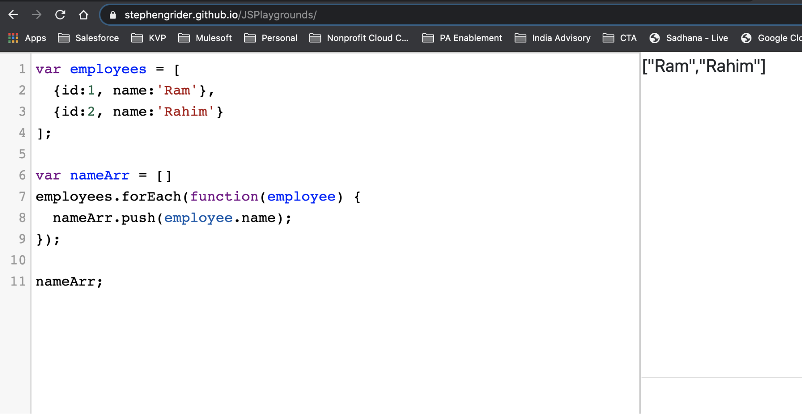

# ES6 Javascript
Recently, I completed ES6 Javascript tutorial on Udemy by Stephen Grider: https://www.udemy.com/course/javascript-es6-tutorial/. While I have been using Javascript for a long time, I had not used many of these new features. Hence thought of capturing key concepts on a page for easy reference. Thanks for the wonderful course, Stephen. 

The following concepts are covered:
* General Points
* `forEach`
* `map`
* `filter` + fat arrow `=>` function declaration. 
* `find`
* `every` & `some`
* `reduce`
* Rest and Spread operators
* Destructuring
* Generators

You can try out the code examples by going to https://stephengrider.github.io/JSPlaygrounds/. The results can be shown just by writing out the variable name. E.g. `nameArr;` as in the first example. See screenshot below.

## General Points
* Use `const` to define constants and `let` to define variables instead of the `var` keyword to define variables. 
* Use template strings to mix text and variable data to output messages. For example \``Your number doubled is ${2 * number}`\` - Here `number` is a variable and also note that the template string has to be enclosed with backticks (\`).
* __Enhanced Object Literals__: 
  * If JSON key value pair both have same name (value is variable name), you can shorten how to write it. E.g. `{color: color}` can be written as `{color}`. Note that internal representation does not change. So if color has value blue, the preceding code will translate to `{'color': 'blue'}` 
  * If an object defines a function in a key value pair as `makeSomething: function() {}`, it can be re-written in a simpler way as `makeSomething() {}`.
* __Default Function Arguments__: Function declaration can define default values of input variables to be used if the invocation does not provide the value. E.g. function doSomething(x = 10, y = 20) will use 10 and 20 as default values of x and y respectively if the invocation does not provide the input values.  
* __Classes__: Class definition allows modeling of a domain object with properties and functions. Define as: `class ClassName {}`. Constructor is a special method defined as `constructor(options)` and used to set properties when a new object is created with `new` keyword. Subclasses can be created using the `extends` keyword, e.g. `class MySubclass extends ClassName`. Subclass constructor should call `super(options)` to allow the parent class to initialize itself. 

## `forEach`
Instead of using a `for` loop, use `forEach` to iterate through an array. 
~~~~
var employees = [
  {id:1, name:'Ram'},
  {id:2, name:'Rahim'}
];

var nameArr = []
employees.forEach(function(employee) {
  nameArr.push(employee.name);
});

nameArr;
~~~~

## `map`
The `map` helper can be used to 'map' source array elements to corresponding target array elements. For example, the code below extracts just the names from the employee objects. 
~~~~
var employees = [
  {id:1, name:'Ram'},
  {id:2, name:'Rahim'}
];

var employeeNames = employees.map(function(employee) {
  return (employee.name);
});

employeeNames;
~~~~

## `filter`
The `filter` helper can be used to 'filter' the input array elements matching the filter criteria into the output array. For example, the code below filters only the female employees. 

Also, note that the fat arrow format of the function definition is shown below. So, instead of using `function(employee)` declaration, the equivalent `(employee) =>` declaration is used. 
~~~~
var employees = [
  {id:1, name:'Ram', gender: 'male'},
  {id:2, name:'Rahim', gender: 'male'}, 
  {id:3, name:'Girija', gender: 'female'}
];

var femaleEmployees = employees.filter((employee) => {
  return (employee.gender === 'female');
});

femaleEmployees;
~~~~

## `find`
The `find` helper works similar to `filter` but returns the first item matching the find criteria. For example, the code below finds an employee named Rahim. 
~~~~
var employees = [
  {id:1, name:'Ram', gender: 'male'},
  {id:2, name:'Rahim', gender: 'male'}, 
  {id:3, name:'Girija', gender: 'female'}
];

var rahim = employees.find((employee) => {
  return (employee.name === 'Rahim');
});

rahim;
~~~~

## `every` & `some`
The `every` helper checks if all the items in an array satisfy some condition and outputs a single boolean value. It performs a logical and (`&`) to a conditional applied to each input array item to output the boolean result. For example, the code below checks if all the employees are male and returns `False`.
~~~~
var employees = [
  {id:1, name:'Ram', gender: 'male'},
  {id:2, name:'Rahim', gender: 'male'}, 
  {id:3, name:'Girija', gender: 'female'}
];

var allMale = employees.every((employee) => {
  return (employee.gender === 'male');
});

allMale;
~~~~

The `some` helper checks if at least one of the items in an array satisfies some condition and outputs a single boolean value. It performs a logical or (`|`) to a conditional applied to each input array item to output the boolean result. For example, the code below checks if at least one employee is male and returns `True`.
~~~~
var employees = [
  {id:1, name:'Ram', gender: 'male'},
  {id:2, name:'Rahim', gender: 'male'}, 
  {id:3, name:'Girija', gender: 'female'}
];

var atLeastOneMale = employees.some((employee) => {
  return (employee.gender === 'male');
});

atLeastOneMale;
~~~~

## `reduce`
The `reduce` helper 'reduces' the input array into a single output value which could be a number, object, or anything else. For example, the code below tabulates the number of male and female employees into an output JSON object of the format `{male: #, female: #}`. 

Note the following two points:
* The `reduce` function takes two parameters: 
  * the function (like the rest of the helpers), and 
  * the initial value of the accumulator - for example `{male: 0, female: 0}` in the code below. 
* The function itself has two parameters:
  * the name of the accumulator variable - for example `acc` in the code below, and 
  * the item of the array (like the rest of the helpers).

The code below returns `{"male":2,"female":1}`.
~~~~
var employees = [
  {id:1, name:'Ram', gender: 'male'},
  {id:2, name:'Rahim', gender: 'male'}, 
  {id:3, name:'Girija', gender: 'female'}
];

var genderCounts = employees.reduce((acc, employee) => {
    if (employee.gender === 'male') return {male: ++acc.male, female: acc.female}
    if (employee.gender === 'female') return {male: acc.male, female: ++acc.female}
}, {male: 0, female: 0});

genderCounts;
~~~~

## Rest & Spread Operators
The __Rest__ operator combines an unknown number of arguments into a single array. For example:
~~~~
function processInputs(a, b, c, d, e, f) {
 return (a * b * c * d * f);
}
~~~~
can be rewritten as:
~~~~
function processInputs(...inputs) {
  return inputs.reduce((product, input) => {
    return product * input;
  }, 1);
}

processInputs(1, 2, 3);
~~~~
The revised function can be invoked not only as `processInputs(1, 2, 3, 4, 5);` but also with fewer or more arguments, e.g. `processInputs(1, 2, 3);` or `processInputs(1, 2, 3, 4, 5, 6, 7);`. In the above function, `...` represents the Rest operator and `...inputs` converts the unknown number of invocation arguments into a single array `inputs`. 

The __Spread__ operator is used to flatten an array into its's constituents. It's used as follows:
~~~~
const arr1 = [1, 2, 3];
const arr2 = [4, 5, 6];

const newArr = [...arr1, ...arr2];

newArr;
~~~~
This will result in newArr containing `[1, 2, 3, 4, 5, 6]`. This is similar to `arr1.concat(arr2);`. In the above function, `...` represents the Spread operator. As can be seen both Rest and Spread operator are represented by `...`.

## Destructuring
Destructuring allows referencing object properties in a concise manner. For example:
~~~~
var file = {name: 'test.jpg', size: 1234};

var output;
function printFile(file) {
  output = `File ${file.name} is of size ${file.size}`;
}

printFile(file);

output;
~~~~
can be rewritten as:
~~~~
var file = {name: 'test.jpg', size: 1234};

var output;
function printFile({name, size}) {
  output = `File ${name} is of size ${size}`;
}

printFile(file);

output;
~~~~
Destructuring works with arrays as well. Need to use square brackets `[]` for getting elements of an array and use braces `{}` to get properties of an object or an array. For example:
~~~~
const weekdays = ['Sun', 'Mon', 'Tue', 'Wed', 'Thu', 'Fri', 'Sat'];

const { length } = weekdays;
const [myFavouriteDay] = weekdays;

length;
myFavouriteDay;
~~~~
will set length to 7 and myFavouriteDay to 'Sun'. We can use a combination of array and object destructuring also. For example: 
~~~~
const employees = [
  {id:1, name:'Ram', gender: 'male'},
  {id:2, name:'Rahim', gender: 'male'}, 
  {id:3, name:'Girija', gender: 'female'}
];

const [, {name}] = employees; // Get's name of the second employee, i.e. name variable is set to Rahim

name;

const accountDesc = {
  fields : ['Id', 'Name', 'Website', 'Phone'] 
}

const {fields: [idField, nameField]} = accountDesc; //idField is set to Id and nameField is set to Name

idField;
nameField;
~~~~
## Generators
Generators allow any object to be iterable using `for of` loop. For example:
~~~~
const exams = {
  midTerm: 'Mid Term Exam',
  final: 'Final Exam',
  [Symbol.iterator]: function* () {
    yield this.midTerm;
    yield this.final;
  }
}

const assignments = {
  assignment1: 'Treasure Island report',
  assignment2: '1000 word essay',
  [Symbol.iterator]: function* () {
    yield this.assignment1;
    yield this.assignment2;
  }
}

const englishCourse = {
  assignments,
  exams, 
  name: 'English Course', 
  department: 'English Department',
  requiredReading: 'Treasure Island',
  [Symbol.iterator]: function* () {
    yield this.name;
    yield this.department;
    yield this.requiredReading;
    yield* this.assignments;
    yield* this.exams;
  }
};

const englishCourseInfo = [];
for (let courseItem of englishCourse) {
  englishCourseInfo.push(courseItem);
}

englishCourseInfo;
~~~~
Here `[Symbol.iterator]` lets an object respond to `for of` loop. `function*` identifies a generator function and each `yield` within it defines what is returned when the object is iterated in a `for of` loop. The three objects in the above example are structured such that the `assignments` and `exams` objects are contained within the `englishCourse` object. All three objects are iterable. The parent `englishCourse` object allows iteration of it's child iterable object by using the keyword `yield*`. 

The calling code iterates through `englishCourse` and adds the elements into `englishCourseInfo` array. The resultant array will contain: `["English Course","English Department","Treasure Island","Treasure Island report","1000 word essay","Mid Term Exam","Final Exam"]`.
